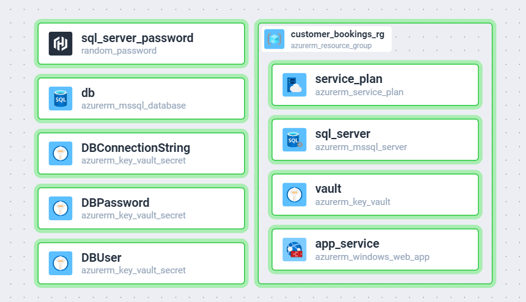
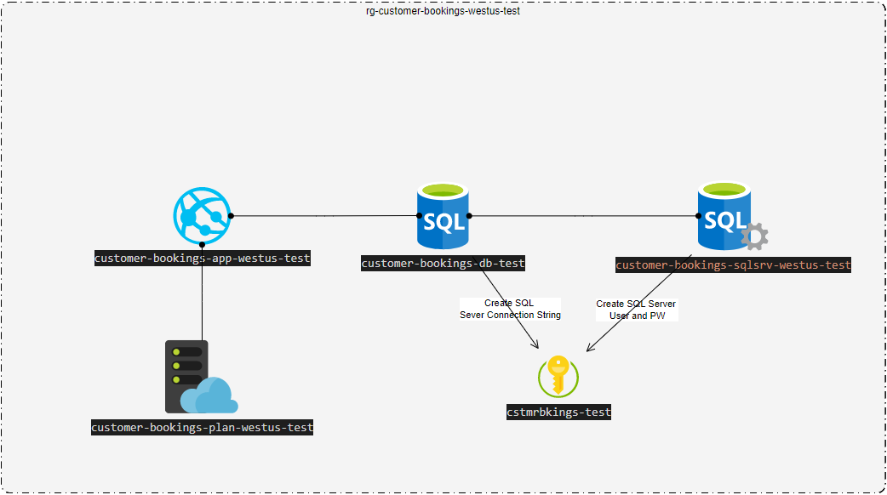

# How to Create Terraform Documentation for a module
- Using Terraform docs tool https://terraform-docs.io/user-guide/installation/#docker
```
docker run --rm --volume "$(pwd):/terraform-docs" quay.io/terraform-docs/terraform-docs:latest markdown /terraform-docs > doc.md
```
- You have to be located in the module folder to generate the documentation.

# Overview of resources being Created


# Overview of current Architecture
